# Mochii
Hiii! This is a room made by CAD!! I've made a cafe here :)

 
<h3> RENDER PICS </H3>
<H2> FURNITURE </H2>

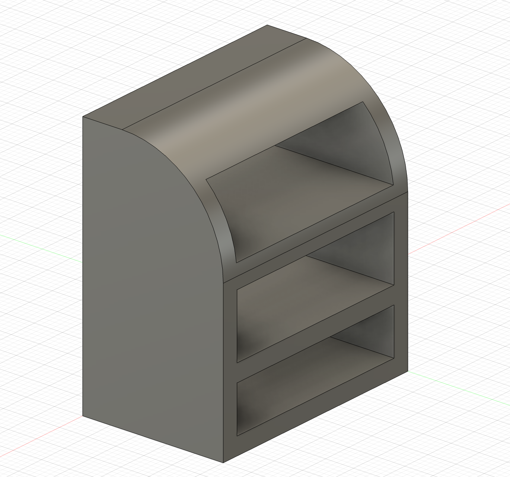
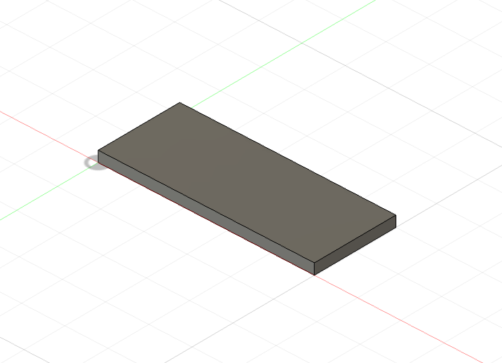
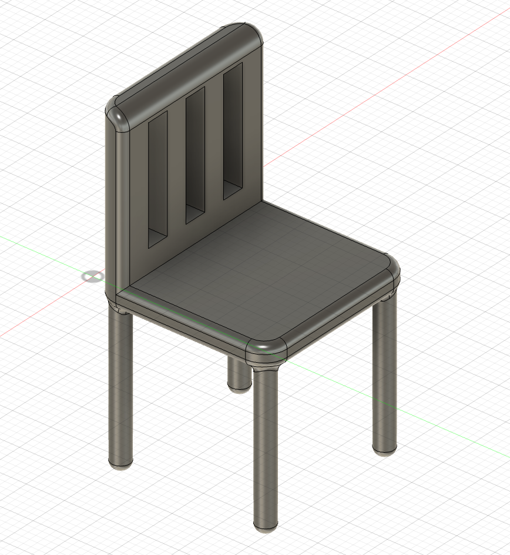
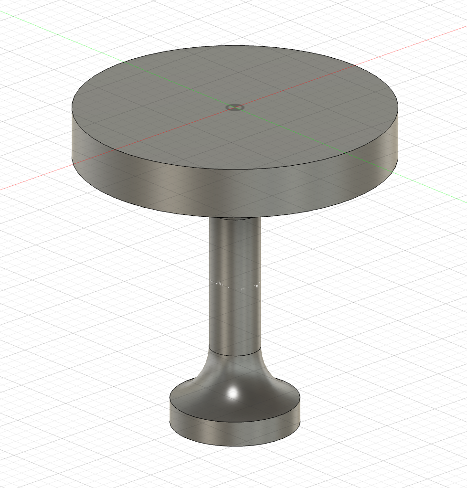
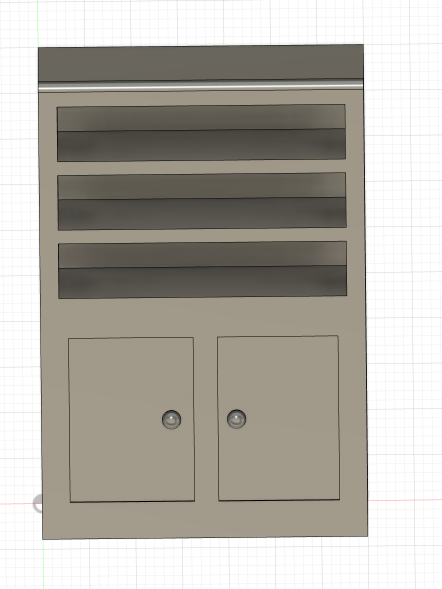
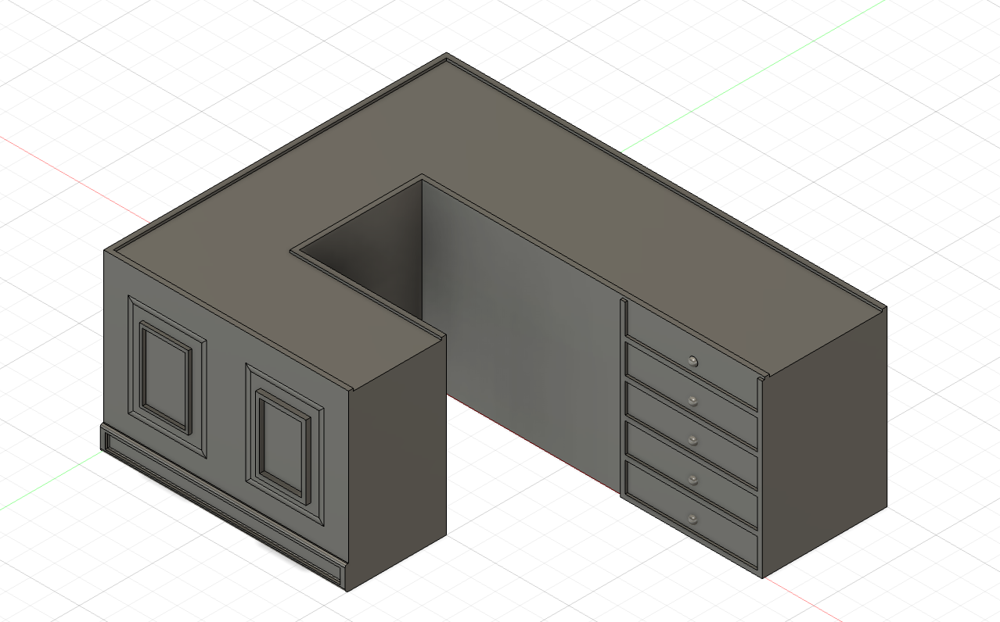
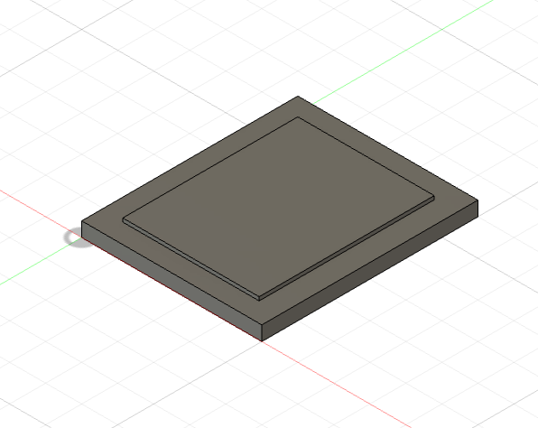
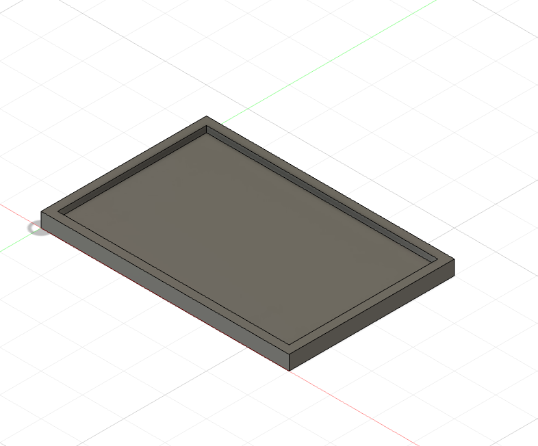
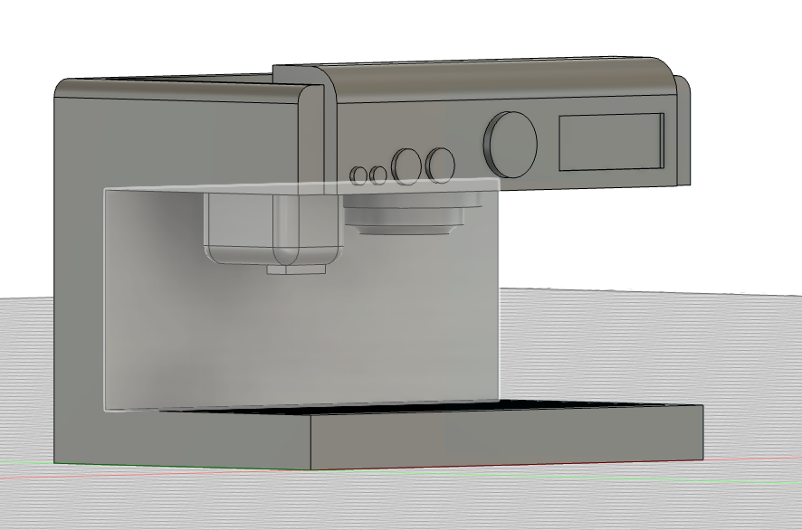
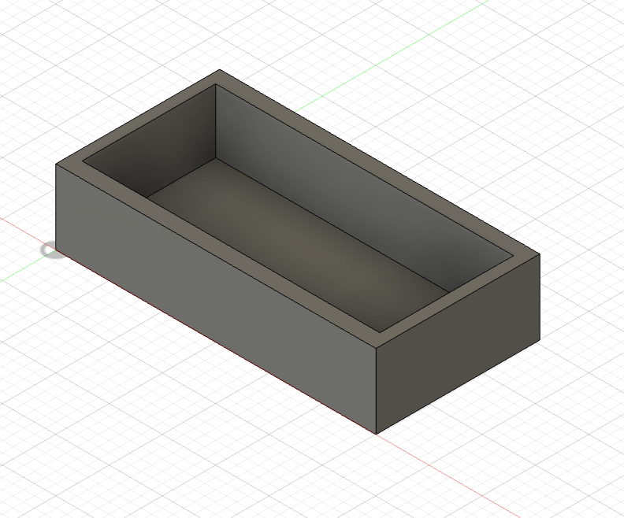
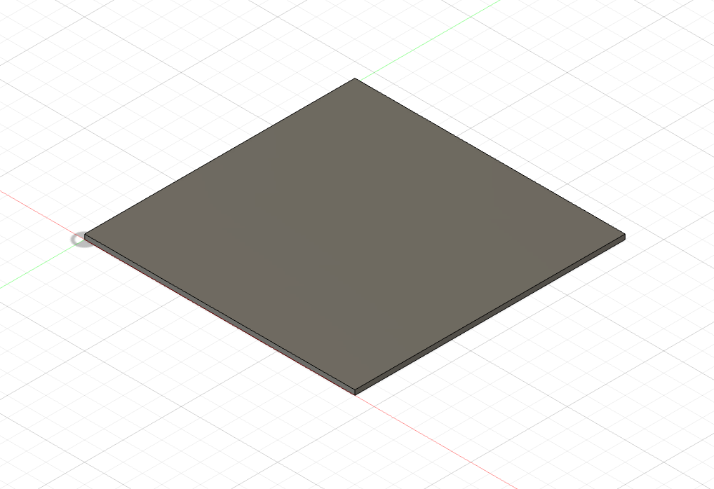
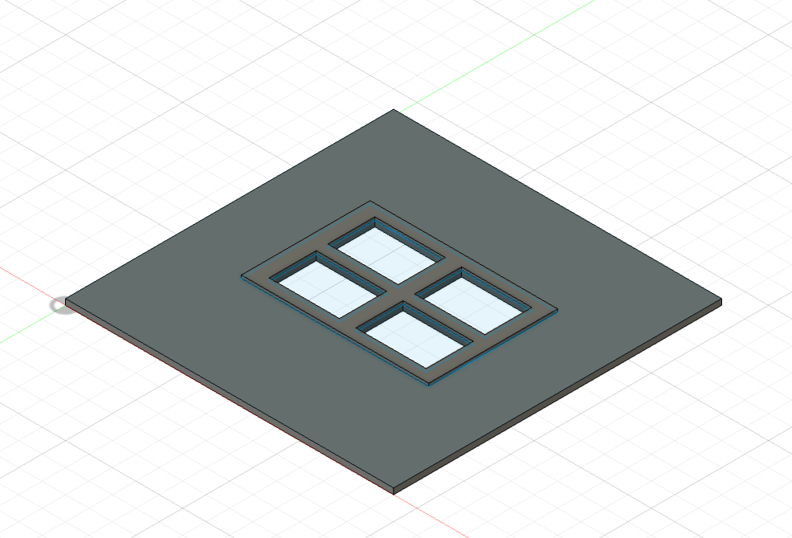
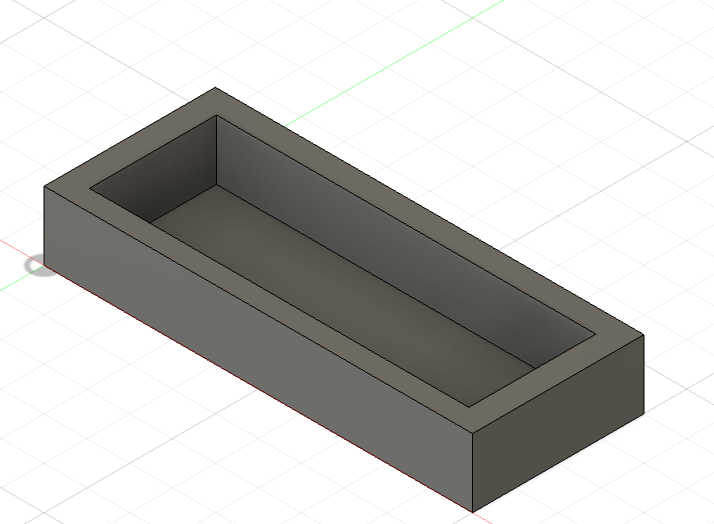

<H2> ROOM </h2>

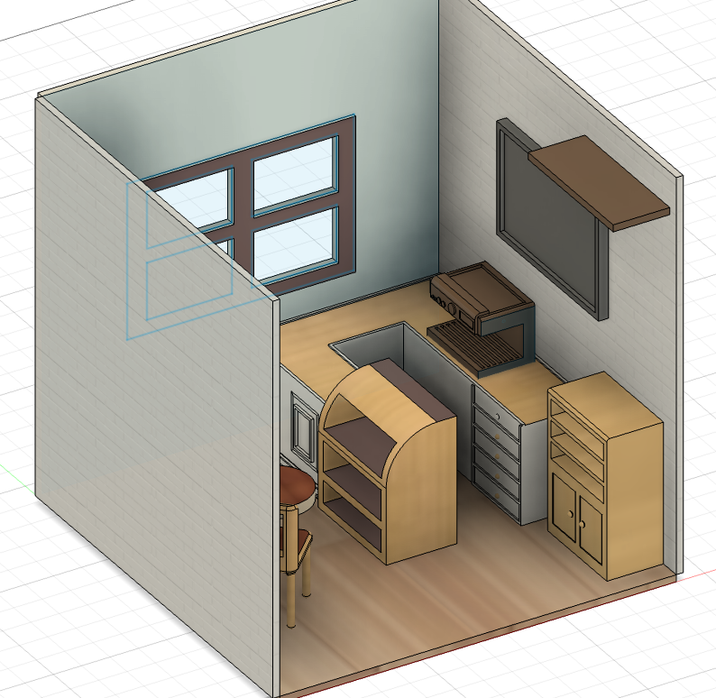
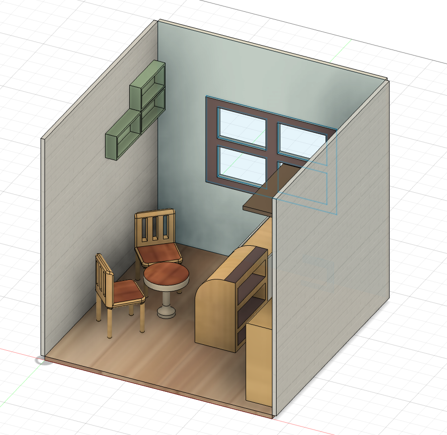
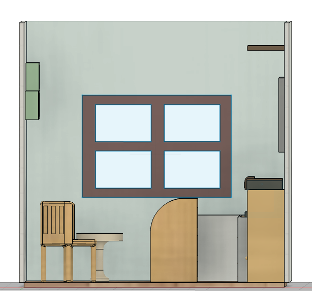
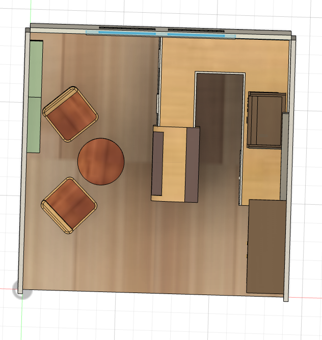

--- 
Credits:
- Fusion 360
- Pinterest
---

You can find the .step files in the repo under "CAD" folder! Tysm :